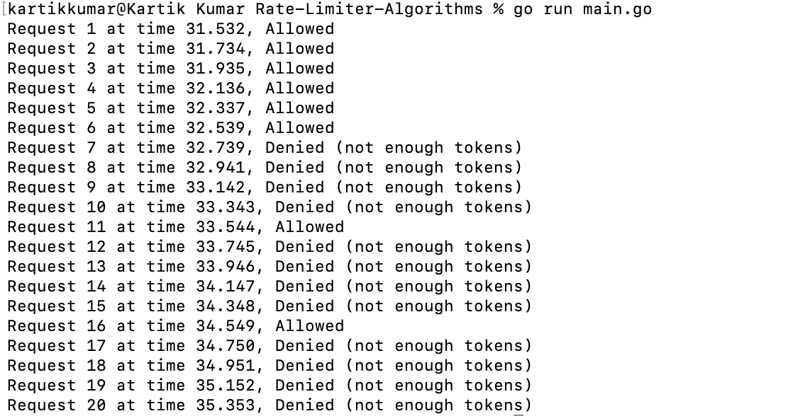

# Rate-Limiter-Algorithms


This project provides implementations of various rate-limiting algorithms in Go. Rate limiting is essential in controlling the rate of traffic sent or received by a network interface controller to prevent resource exhaustion and ensure fair usage among multiple clients.

## Table of Contents

- [Overview](#overview)
- [Implemented Algorithms](#implemented-algorithms)
- [Getting Started](#getting-started)
  - [Prerequisites](#prerequisites)
  - [Installation](#installation)
- [Usage](#usage)
  - [Selecting an Algorithm](#selecting-an-algorithm)
- [Algorithm Details](#algorithm-details)
  - [Token Bucket](#token-bucket)
  - [Leaky Bucket](#leaky-bucket)
  - [Fixed Window](#fixed-window)
  - [Sliding Window Log](#sliding-window-log)
  - [Sliding Window Counter](#sliding-window-counter)
- [Contributing](#contributing)

## Overview

This repository showcases how different rate-limiting algorithms can be implemented and used in Go. Each algorithm has its own characteristics and use-cases, providing flexibility depending on the requirements.

## Implemented Algorithms

- **Token Bucket**
- **Leaky Bucket**
- **Fixed Window**
- **Sliding Window Log**
- **Sliding Window Counter**

## Getting Started

### Prerequisites

- Go installed on your machine (version 1.16 or higher recommended).

### Installation

1. **Clone the repository**

   ```bash
   git clone https://github.com/yourusername/rate-limiter-algorithms.git
   ```

2. **Navigate to the project directory**

   ```bash
   cd rate-limiter-algorithms
   ```

3. **Install dependencies**

   Ensure that all required packages are installed. You might need to initialize the module and download dependencies:


## Usage

You can run the `main.go` file to see the rate limiter in action.

```bash
go run main.go
```

The output will show whether each request is allowed or denied based on the selected rate-limiting algorithm.

### Selecting an Algorithm

In the `main.go` file, you can select which rate-limiting algorithm to use by changing the argument passed to `GetRateLimiter`:

```go
ratelimiter, err := ratelimiterFactory.GetRateLimiter("algorithm_name")
```

Replace `"algorithm_name"` with one of the following options:

- `"token"`
- `"leaky"`
- `"fixed_window"`
- `"sliding_window_log"`
- `"sliding_window_counter"`

**Example:**

To use the Token Bucket algorithm:

```go
ratelimiter, err := ratelimiterFactory.GetRateLimiter("token")
```


## Algorithm Details

### Token Bucket

The Token Bucket algorithm allows requests up to a certain capacity. Tokens are added to the bucket at a fixed rate, and each request consumes a token. If the bucket has enough tokens, the request is allowed.

- **Use-case:** Controlling the average rate of requests while allowing bursts.

#### Output

Below is the output when the **Token Bucket** algorithm was used. The bucket has a capacity of 5 tokens, and 1 token is refilled every second. Requests are allowed if there are enough tokens.



Here’s the detailed flow for all subsequent requests :

**Request 1 at 31.532 seconds**:
- **Tokens left before the request**: 5  
- **Tokens added**: 0.0  
- **Total tokens after addition**: 5.0  
- **Tokens left after request**: 4.0  

**Request 2 at 31.734 seconds**:
- **Tokens left before the request**: 4  
- **Tokens added**: 0.2  
- **Total tokens after addition**: 4.2  
- **Tokens left after request**: 3.2  

**Request 3 at 31.935 seconds**:
- **Tokens left before the request**: 3.2  
- **Tokens added**: 0.2  
- **Total tokens after addition**: 3.4  
- **Tokens left after request**: 2.4  

**Request 4 at 32.136 seconds**:
- **Tokens left before the request**: 2.4  
- **Tokens added**: 0.2  
- **Total tokens after addition**: 2.6  
- **Tokens left after request**: 1.6  

**Request 5 at 32.337 seconds**:
- **Tokens left before the request**: 1.6  
- **Tokens added**: 0.2  
- **Total tokens after addition**: 1.8  
- **Tokens left after request**: 0.8  

**Request 6 at 32.539 seconds**:
- **Tokens left before the request**: 0.8  
- **Tokens added**: 0.2  
- **Total tokens after addition**: 1.0  
- **Tokens left after request**: 0.0  

**Request 7 at 32.739 seconds (Denied)**:
- **Tokens left before the request**: 0.0  
- **Tokens added**: 0.2  
- **Total tokens after addition**: 0.2  
- **Tokens left after request**: 0.2 (Request denied due to insufficient tokens)

#### Summary

In the **Token Bucket** algorithm, tokens are consumed at a rate of 1 per request, and refilled at a rate of 1 token per second. Because the interval between requests is 200 milliseconds (0.2 seconds), only 0.2 tokens are refilled before each new request. The breakdown shows how tokens are added before each request and how many are left after consumption.

#### Reason behind keeping tokens as float:

By using floating-point values to track tokens and time precisely, the algorithm ensures that requests are allowed as soon as enough tokens are available, even if it's a fractional amount (like 0.2 tokens).
This approach provides a smoother and more accurate rate-limiting mechanism, ensuring requests are handled precisely according to the configured rate limit.

**For more details, refer to the code implementation**


### Leaky Bucket

The Leaky Bucket algorithm processes requests at a constant rate. Incoming requests are added to the bucket, and they "leak" out at a steady pace.

- **Use-case:** Smoothing out bursts in traffic by processing requests uniformly.

### Fixed Window

The Fixed Window algorithm limits the number of requests in fixed time intervals. The count resets after each interval.

- **Use-case:** Simple rate limiting with fixed intervals, but can cause issues at boundary conditions.

### Sliding Window Log

The Sliding Window Log algorithm keeps a log of timestamps for each request and allows requests based on the number within a sliding time window.

- **Use-case:** More accurate than Fixed Window by considering the exact time of requests.

### Sliding Window Counter

The Sliding Window Counter algorithm divides time into smaller intervals and keeps counts for each. It calculates the weighted sum to decide if a request should be allowed.

- **Use-case:** Balances accuracy and performance, reducing the memory footprint compared to Sliding Window Log.

## Contributing

Contributions are welcome! If you'd like to enhance the project or fix issues, please follow these steps:

1. **Fork the repository**

2. **Create a new branch**

   ```bash
   git checkout -b feature/your-feature-name
   ```

3. **Make your changes**

4. **Commit your changes**

   ```bash
   git commit -m "Add your message"
   ```

5. **Push to the branch**

   ```bash
   git push origin feature/your-feature-name
   ```

6. **Open a Pull Request**

